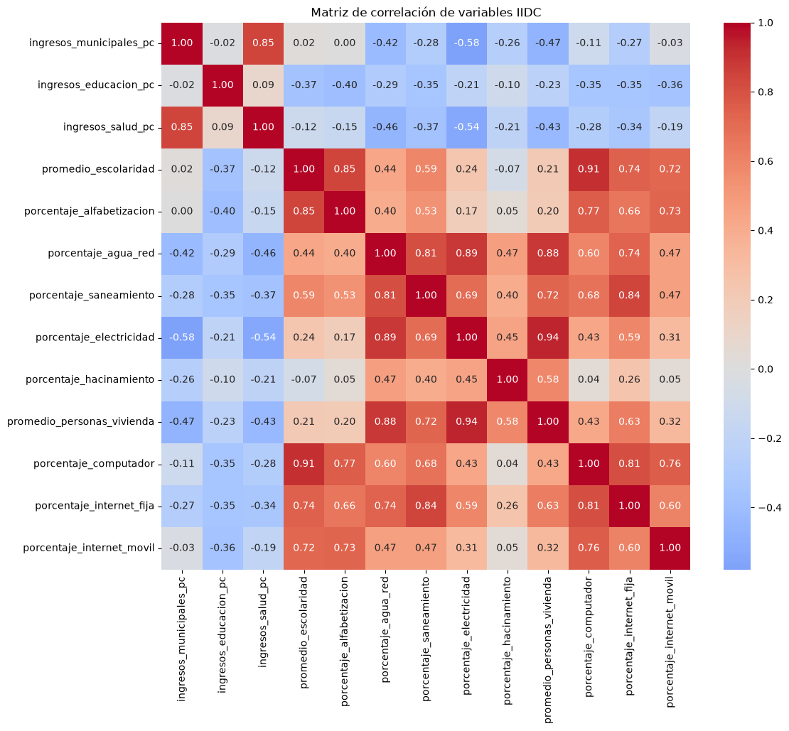
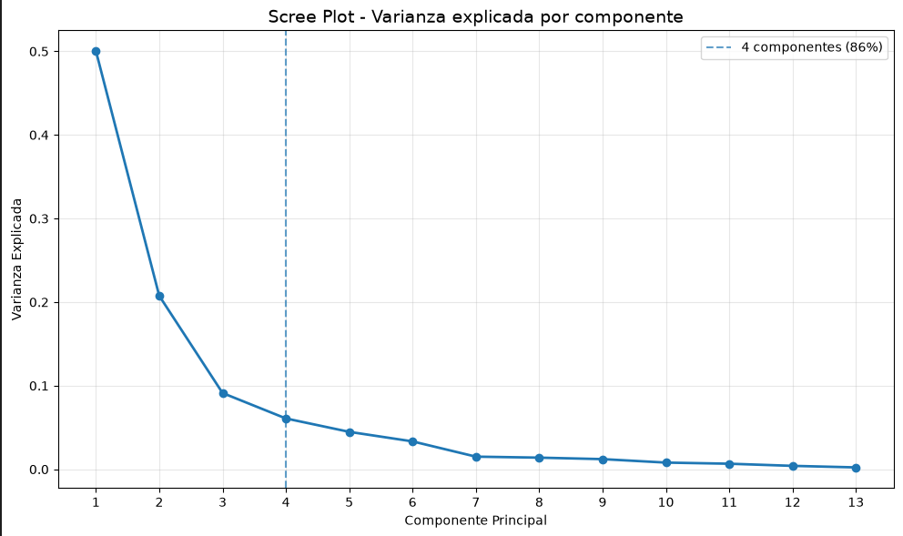
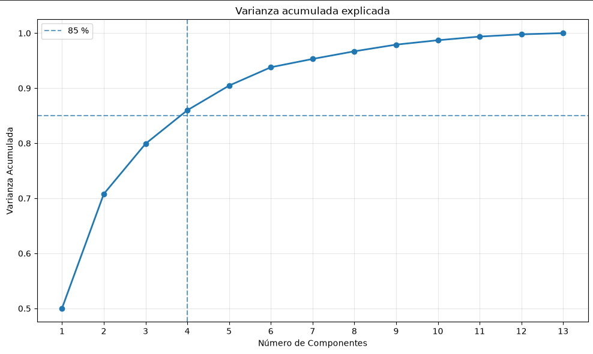

# Análisis Multivariado

**Proyecto:** Índice de Desarrollo Comunal de Chile (IIDC)

**Documento:** 03 - Análisis Multivariado

**Versión:** 1.0

**Autor:** Nelson Daniel Díaz Dean

---

# 1. Objetivo

Una vez comprendido el comportamiento individual de las variables, el siguiente paso consistió en estudiar su comportamiento conjunto.

El objetivo principal fue identificar relaciones entre indicadores, detectar posibles redundancias y comprender la estructura estadística subyacente del Índice de Desarrollo Comunal (IIDC).

Para ello se desarrollaron tres análisis complementarios:

* Correlaciones.
* Multicolinealidad (VIF).
* Análisis de Componentes Principales (PCA).

Estos análisis permitieron validar la estructura conceptual del índice antes de su construcción definitiva.

---

# 2. Matriz de correlaciones

Como primera aproximación se calculó la matriz de correlación de Pearson entre todas las variables utilizadas en el IIDC.

El objetivo fue responder una pregunta fundamental:

> ¿Qué variables describen prácticamente el mismo fenómeno?

La matriz permitió identificar grupos naturales de variables altamente relacionadas, así como variables con un comportamiento considerablemente distinto al resto.

---

## Figura 1. Heatmap de correlaciones

*(El heatmap que construimos con matplotlib.)*

---

## Principales observaciones

El análisis permitió identificar varios grupos de variables altamente correlacionadas.

Entre las relaciones más relevantes destacan:

| Variables                             | Correlación |
| ------------------------------------- | ----------: |
| Escolaridad ↔ Computador              |      ≈ 0.91 |
| Electricidad ↔ Personas por vivienda  |      ≈ 0.94 |
| Agua ↔ Electricidad                   |      ≈ 0.89 |
| Agua ↔ Personas por vivienda          |      ≈ 0.88 |
| Escolaridad ↔ Alfabetización          |      ≈ 0.85 |
| Ingresos municipales ↔ Ingresos salud |      ≈ 0.85 |
| Agua ↔ Saneamiento                    |      ≈ 0.81 |
| Computador ↔ Internet fija            |      ≈ 0.81 |

Estas relaciones evidencian que diversas variables representan dimensiones similares del desarrollo comunal.

---

# 3. Interpretación inicial

Las correlaciones observadas permitieron plantear una primera hipótesis:

Las dimensiones inicialmente definidas para el índice (economía, infraestructura, conectividad, capital humano y habitabilidad) no son completamente independientes entre sí.

Por el contrario, existen grupos de variables que evolucionan conjuntamente y podrían estar midiendo un mismo fenómeno latente.

Esta observación justificó la necesidad de evaluar formalmente la existencia de multicolinealidad.

---

# 4. Análisis de multicolinealidad

Para cuantificar el grado de redundancia existente entre las variables se calculó el Factor de Inflación de la Varianza (Variance Inflation Factor, VIF).

El VIF permite estimar cuánto aumenta la varianza de una variable debido a su relación con las demás.

En términos generales:

* VIF < 5 → baja multicolinealidad.
* VIF entre 5 y 10 → moderada.
* VIF > 10 → alta multicolinealidad.

---

## Resultados

Los resultados mostraron que la mayoría de las variables asociadas a infraestructura, conectividad y capital humano presentan valores elevados de VIF.

Las variables con mayor redundancia fueron:

* promedio_escolaridad
* porcentaje_alfabetizacion
* porcentaje_internet_movil
* promedio_personas_vivienda
* porcentaje_electricidad

En contraste, la variable ingresos_educacion_pc presentó uno de los valores de VIF más bajos dentro del grupo económico, indicando un comportamiento considerablemente más independiente.

---

## Interpretación

La elevada multicolinealidad observada no constituye un problema para la interpretación del desarrollo comunal.

Por el contrario, representa evidencia de que varias variables están describiendo dimensiones comunes del fenómeno estudiado.

Esta situación justificó la aplicación de un Análisis de Componentes Principales (PCA).

---

# 5. Análisis de Componentes Principales (PCA)

El PCA fue utilizado como herramienta de validación estructural.

Su objetivo no fue reemplazar el índice conceptual, sino responder una pregunta distinta:

> ¿Cuántas dimensiones independientes existen realmente en los datos?

---

## Varianza explicada

Los resultados obtenidos fueron:

| Componente | Varianza explicada |
| ---------- | -----------------: |
| PC1        |             50.0 % |
| PC2        |             20.7 % |
| PC3        |              9.1 % |
| PC4        |              6.1 % |

Los cuatro primeros componentes explican aproximadamente el **86 %** de toda la variabilidad observada.

---

## Figura 2. Scree Plot del Análisis de Componentes Principales

## Figura 3. Varianza acumulada explicada por las componentes principales

---

## Interpretación de las componentes

El análisis de cargas factoriales permitió interpretar las primeras componentes principales.

### PC1

Representa una dimensión general del desarrollo comunal.

Agrupa variables relacionadas con:

* infraestructura;
* conectividad;
* capital humano;
* condiciones generales de desarrollo.

Esta componente explica aproximadamente la mitad de toda la variabilidad del dataset.

---

### PC2

Refleja un contraste entre variables económicas y ciertos indicadores estructurales.

Sugiere la existencia de distintos perfiles comunales más allá del nivel general de desarrollo.

---

### PC3

Está dominada principalmente por:

* ingresos municipales;
* ingresos en salud.

Esta componente parece representar una dimensión asociada a la capacidad financiera municipal.

---

### PC4

Presenta una carga dominante correspondiente a los ingresos en educación.

Este comportamiento confirma que dicha variable posee una estructura distinta al resto de variables económicas, consistente con la hipótesis planteada durante las etapas anteriores sobre el efecto de la implementación de los Servicios Locales de Educación Pública (SLEP).

---

# 6. Principales hallazgos

El análisis multivariado permitió llegar a varias conclusiones importantes.

## Hallazgo 1

Las dimensiones conceptuales inicialmente definidas presentan importantes niveles de superposición estadística.

---

## Hallazgo 2

Infraestructura, conectividad y capital humano evolucionan conjuntamente en gran parte de las comunas del país.

---

## Hallazgo 3

Los ingresos municipales y los ingresos en salud muestran una fuerte asociación entre sí.

---

## Hallazgo 4

Los ingresos en educación presentan un comportamiento claramente diferenciado respecto del resto de variables económicas.

---

## Hallazgo 5

La estructura estadística del dataset puede resumirse mediante un número reducido de dimensiones latentes sin perder una proporción importante de la información original.

---

# 7. Conclusiones

El análisis multivariado permitió validar estadísticamente la estructura del proyecto antes de construir el Índice de Desarrollo Comunal.

Las técnicas aplicadas evidenciaron que muchas variables describen fenómenos comunes y que la clasificación conceptual inicial no reproduce exactamente la estructura empírica de los datos.

Lejos de representar una limitación, este resultado permitió comprender con mayor profundidad el comportamiento del desarrollo comunal y proporcionó evidencia objetiva para respaldar las decisiones metodológicas adoptadas durante la construcción del IIDC.

El PCA fue utilizado como una herramienta de validación y no como un sustituto del índice conceptual, permitiendo contrastar la teoría con la estructura estadística observada.

---

# 8. Lecciones aprendidas

* Una alta correlación entre variables no implica necesariamente redundancia conceptual, pero sí puede indicar la existencia de dimensiones comunes.
* El VIF permitió cuantificar objetivamente la multicolinealidad presente en el conjunto de indicadores.
* El PCA confirmó que gran parte de la información contenida en las variables puede resumirse mediante un número reducido de componentes.
* La evidencia estadística permitió fortalecer la construcción metodológica del IIDC en lugar de reemplazarla.
* El análisis exploratorio y el análisis multivariado constituyen etapas complementarias para comprender fenómenos complejos como el desarrollo comunal.
