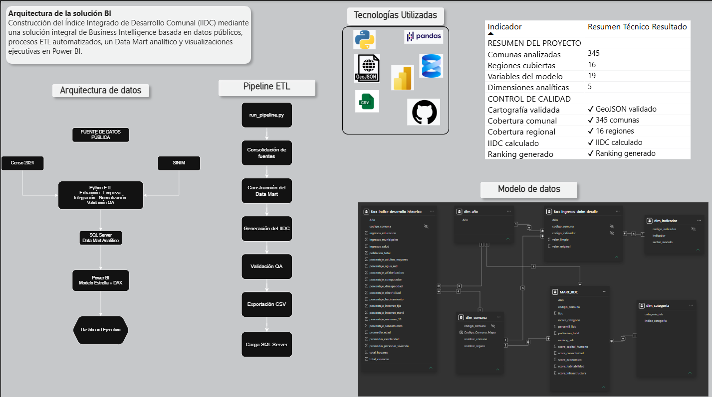
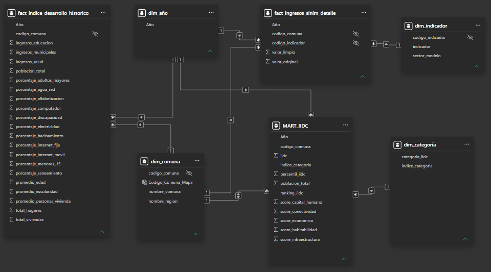
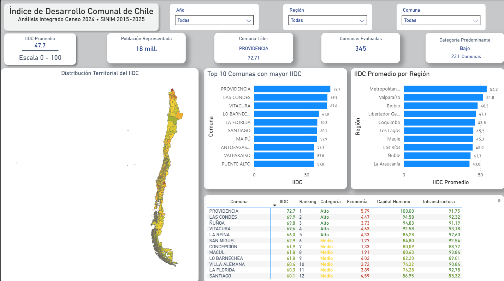
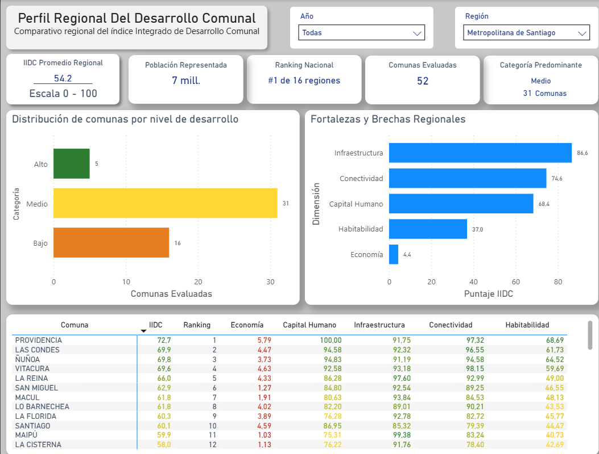
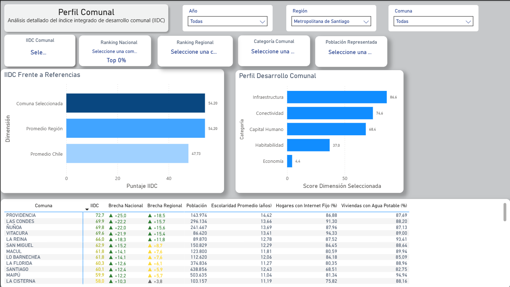

# Índice Integrado de Desarrollo Comunal (IIDC) - Chile

## Descripción

Este proyecto presenta una solución integral de Business Intelligence para la construcción del **Índice Integrado de Desarrollo Comunal (IIDC)** de las 345 comunas de Chile.

El objetivo consiste en integrar información proveniente del **Censo 2024**, indicadores municipales del **Sistema Nacional de Información Municipal (SINIM)** y cartografía oficial para construir un indicador compuesto que permita comparar objetivamente el nivel de desarrollo de cada comuna mediante un modelo analítico reproducible.

La solución incorpora procesos ETL desarrollados en Python, modelamiento dimensional en SQL Server y visualizaciones ejecutivas construidas en Power BI.

---

# Arquitectura de la Solución

La arquitectura implementada contempla un flujo completo de ingeniería de datos:

- Extracción de datos públicos
- Procesos ETL automatizados
- Validaciones de calidad
- Construcción del Data Mart
- Modelado dimensional
- Visualización ejecutiva en Power BI



## Tecnologías utilizadas

- Python
- Pandas
- SQL Server
- Power BI
- GeoJSON
- Git
- GitHub

## Pipeline ETL

El procesamiento se encuentra automatizado mediante un pipeline desarrollado en Python.

Las principales etapas son:

1. Descarga y consolidación de fuentes públicas.
2. Integración de indicadores SINIM.
3. Construcción de tablas del modelo analítico.
4. Validaciones de calidad.
5. Exportación del Data Mart.
6. Carga hacia SQL Server.
7. Consumo desde Power BI.


## Modelo Dimensional

El proyecto utiliza un modelo estrella para optimizar el rendimiento analítico y facilitar la construcción de medidas DAX.



# Dashboard

La solución incorpora cuatro vistas principales.

## Panorama Nacional

Comparación territorial del IIDC mediante mapas, rankings y análisis regional.



---

## Radiografía Regional

Análisis comparativo de indicadores por región, permitiendo identificar fortalezas y brechas territoriales.



---

## Perfil Comunal

Ficha ejecutiva de cada comuna con indicadores históricos, comparación nacional y análisis de desempeño.



---

## Arquitectura Técnica

Documentación visual de la solución desarrollada.


## Estructura

```text
Datos/
Documentación/
Imágenes/
Python/
SQL/
Índice de Desarrollo Comunal.pbix
requirements.txt
```

## Ejecución

1. Clonar el repositorio.
2. Crear el entorno virtual.
3. Instalar dependencias.

```bash
pip install -r requirements.txt
```

4. Ejecutar

```bash
python Python/run_pipeline.py
```

5. Abrir el archivo Power BI.

# Habilidades demostradas

Durante el desarrollo de este proyecto se aplicaron conocimientos de:

- Ingeniería de Datos
- ETL
- Data Quality
- SQL Server
- Modelado Dimensional
- Python
- Power BI
- DAX
- Power Query
- Visualización Ejecutiva
- Storytelling con datos
- Git
- GitHub

## Próximas mejoras

- Automatización mediante Azure Data Factory o Microsoft Fabric.
- Publicación del modelo en Power BI Service.
- Actualización automática de fuentes de datos.
- Incorporación de análisis predictivo.

## Autor

**Nelson Daniel Díaz Dean**

Business Intelligence | Data Analytics | Power BI | SQL Server | Python

LinkedIn: https://www.linkedin.com/in/nelson-d%C3%ADaz-de%C3%A1n/